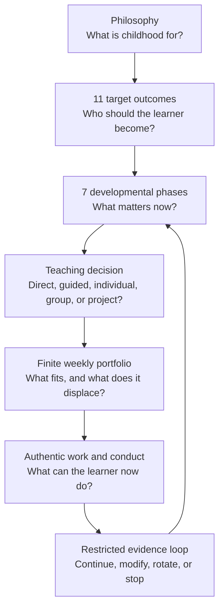
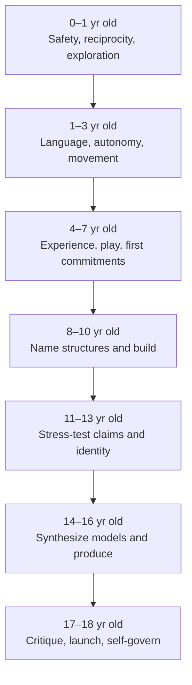
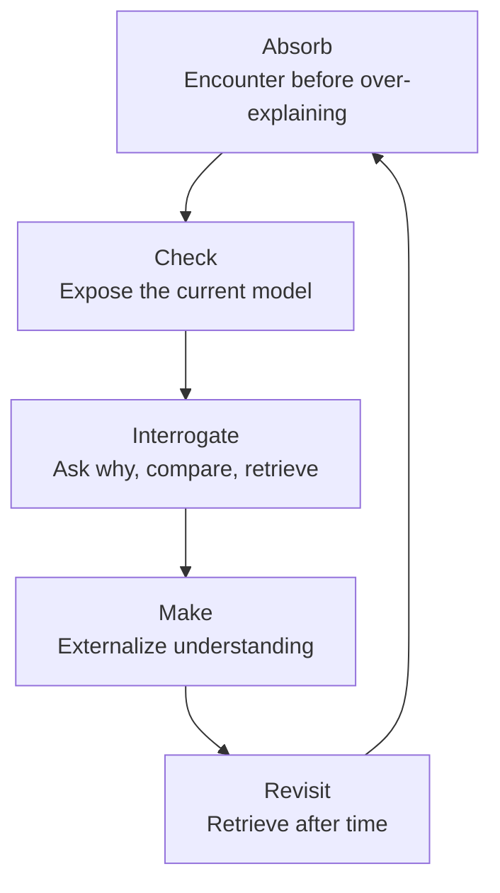
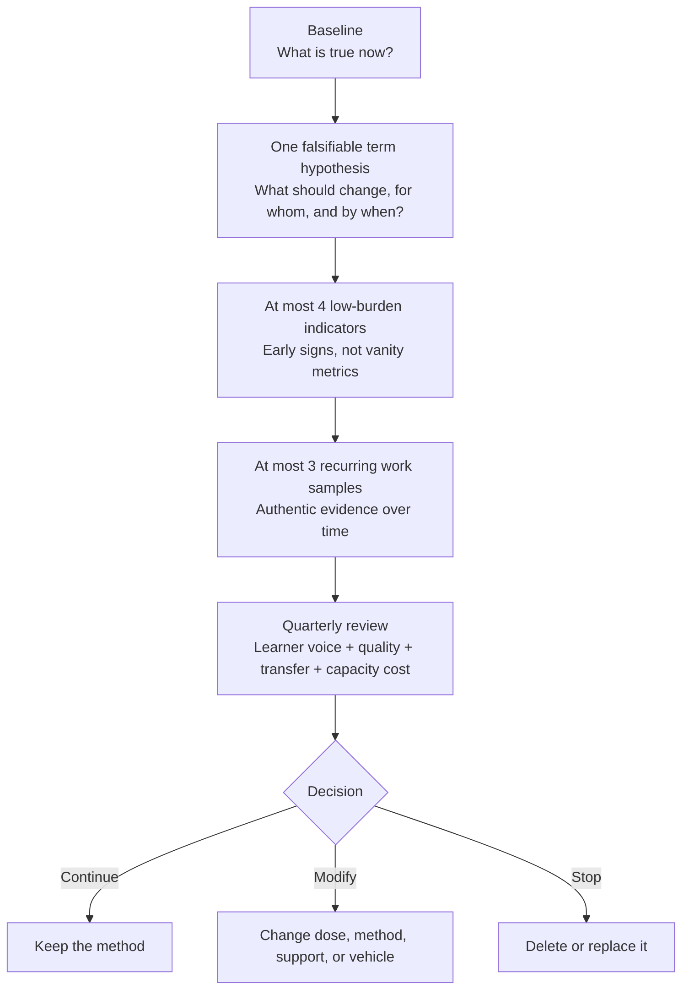
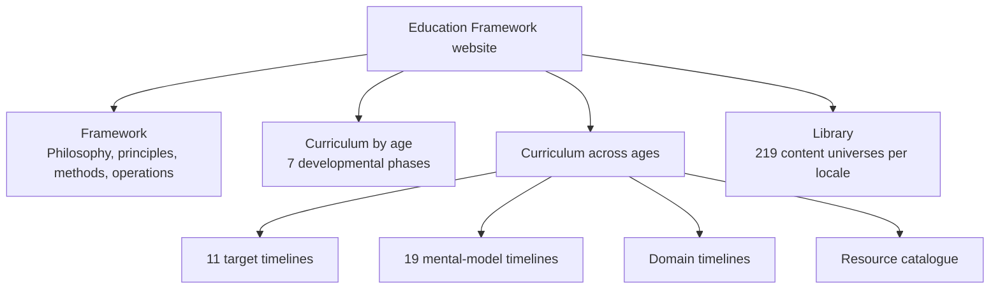

# Education Framework — Content-Builder Summary

**Purpose:** a concise, portable source for planning and writing Education Framework content.

**Scope:** philosophy, outcomes, developmental sequence, teaching logic, operating constraints, resilience architecture, evidence boundaries, and website content structure.

**Canonical status:** this document is a map, not a replacement for the detailed source. When details conflict, the [capacity-governed execution layer](execution-layer.md), [`capacity-model.json`](../config/capacity-model.json), [`hardship-model.json`](../config/hardship-model.json), and the paired [English](../src/content/phases/) and [Spanish](../src/content/phases-es/) phase files control.

**Last reconciled:** 2026-08-27.

## Contents

- [Thesis](#thesis)
- [System at a glance](#system-at-a-glance)
- [Ten principles](#ten-principles)
- [Eleven target outcomes](#eleven-target-outcomes)
- [Development from 0 to 18 yr old](#development-from-0-to-18-yr-old)
- [Thinking toolkit](#thinking-toolkit)
- [Teaching and pacing logic](#teaching-and-pacing-logic)
- [Core curriculum architecture](#core-curriculum-architecture)
- [Capacity-governed execution](#capacity-governed-execution)
- [Resilience and hardship](#resilience-and-hardship)
- [Personalization, relationships, and safety](#personalization-relationships-and-safety)
- [Evaluation and evidence integrity](#evaluation-and-evidence-integrity)
- [Website and content architecture](#website-and-content-architecture)
- [Content-construction template](#content-construction-template)
- [Questions before adding content](#questions-before-adding-content)
- [Editorial and technical quality gates](#editorial-and-technical-quality-gates)
- [Canonical source map](#canonical-source-map)

## Thesis

The Education Framework is a developmental operating system for **0–18 yr old learners**. Its aim is not maximal content consumption or a single admissions result. Its aim is a capable, independent, ethical, relational, physically competent, and creatively productive adult.

Its central formula is:

> **Guided childhood with freedom. Start early, remain consistent, revisit at greater depth, and convert knowledge into capable action.**

The framework combines a broad intellectual and cultural base with one or more areas of genuine depth. It protects relationships, sleep, health, joy, recovery, and unstructured time as infrastructure rather than treating them as rewards left over after achievement.

It is **not** one national school system, one pedagogy, a list of simultaneous extracurriculars, or a claim that every child should follow the same route. It is a decision architecture that can operate as:

- an overlay on an external school;
- a hybrid shared with a partner school; or
- a complete school model with responsibility for academic entitlement, safeguarding, records, and credentials.

## System at a glance



| Layer | Question it answers | Core mechanism |
|---|---|---|
| Philosophy | What is worth developing? | Ten principles |
| Outcomes | Who should the learner become? | Eleven target outcomes |
| Development | What is appropriate now? | Seven age phases from 0–18 yr old |
| Cognition | How should thinking deepen? | Nineteen mental models, revisited through five modes |
| Instruction | How should this function be learned? | Explicit instruction, guided inquiry, individual practice, collective work, tutoring, and projects |
| Curriculum | What carries the learning? | Academic entitlement, domains, content universes, resources, and real responsibilities |
| Operations | What can actually fit? | Delivery mode, weekly guarantees, choose-N alternatives, buffers, rotations, and hard caps |
| Evaluation | Is it helping this learner? | Baseline, one term hypothesis, limited indicators and work samples, quarterly decision |

## Ten principles

| Principle | Operational meaning | Failure to avoid |
|---|---|---|
| **1. Compounding Is Everything** | Start early, practise consistently, space retrieval, and revisit concepts at increasing depth. | Repeatedly replacing a good practice with a novel one; cramming without retention. |
| **2. Depth Within Breadth** | Explore broadly, then develop a demonstrable specialist spike while retaining a generalist base. | Premature specialization; or permanent sampling that never produces mastery. |
| **3. Relationships Are Infrastructure** | Treat attachment, family trust, friendship, mentors, teamwork, and peer networks as developmental systems. | Sacrificing relationship quality for compliance or output. |
| **4. Communication Is Everything** | Develop written, oral, visual, digital, performative, persuasive, and negotiating competence. | Treating literacy as silent reading and school essays only. |
| **5. Self-Awareness Is the Operating System** | Learn one's patterns, biases, limits, energy, stress signals, failure modes, and recovery strategies. | Turning a temporary profile into a fixed identity or amateur diagnosis. |
| **6. Practice, Not Theory** | Use retrieval, deliberate practice, feedback, application, and finished work. Ship reversible attempts and revise. | Passive familiarity, ornamental knowledge, or endless planning. |
| **7. Joy Is the Signal; Gratitude Is the Practice** | Preserve process joy, flow, and intrinsic motivation; use gratitude as a modest reflective practice. | Equating constant pleasure with alignment, or treating sustained joylessness as virtue. |
| **8. Kindness Creates Luck** | Combine preparation, exposure, usefulness, and prosocial conduct. Protect the downside while taking selected asymmetric bets. | Niceness without boundaries; résumé service; avoidable ruin for marginal gain. |
| **9. Physical System Mastery** | Protect sleep first, then nutrition, movement, physical competence, and recovery. | Adding enrichment by borrowing from physiology. |
| **10. Sensitive Periods Matter — Act with Urgency** | Invest early where timing changes ease or probability, while preserving the reality of later learning and repair. | Fatalistic age cut-offs or invented biological urgency. |

## Eleven target outcomes

These are **developmental outcomes**, not eleven separate subjects or weekly obligations. A single well-designed activity may serve several targets. Each target must eventually appear as independent conduct or authentic output, not merely as vocabulary the learner can repeat.

| # | Target | Concise definition | Stronger evidence of progress |
|---:|---|---|---|
| 1 | **Resilient Self-Efficacy** | “I can figure this out, even when it is difficult and takes time.” | Persists, seeks useful help, changes strategy, and returns after setback. |
| 2 | **Agency and Moral Reasoning** | Chooses deliberately, reasons about duties and consequences, and owns decisions. | Makes real choices, explains trade-offs, repairs harm, and accepts proportionate consequences. |
| 3 | **Self-Awareness and Self-Regulation** | Understands and increasingly governs attention, emotion, energy, and behavior. | Notices state changes, selects a regulation strategy, and adjusts workload before collapse. |
| 4 | **Deep Curiosity** | Sustains attention long enough to move from interest to understanding. | Develops questions, follows sources, tolerates confusion, and returns without prompting. |
| 5 | **First-Principles Reasoning** | Decomposes claims into assumptions and rebuilds from evidence and mechanism. | States assumptions, identifies causal structure, compares alternatives, and revises when falsified. |
| 6 | **Communication Mastery** | Expresses, explains, persuades, negotiates, and listens across media. | Adapts to audience, represents objections fairly, revises, and can defend the result. |
| 7 | **Relational Intelligence** | Builds trust, reads dynamics, collaborates, negotiates roles, and repairs conflict. | Contributes reliably where other people's responses genuinely affect the outcome. |
| 8 | **Compassion and Kindness** | Recognizes need and acts usefully without abandoning judgment, consent, or boundaries. | Provides help the recipient considers useful; avoids saviorism and performative service. |
| 9 | **Physical System Mastery** | Independently manages sleep, movement, nutrition, recovery, and calibrated challenge. | Makes sound decisions under strain and can recover without external micromanagement. |
| 10 | **Adaptability** | Revises models, strategies, and routes when evidence or conditions change. | Runs reversible experiments, handles unfamiliar contexts, and avoids identity lock-in. |
| 11 | **Creative Production** | Produces original, valuable work through combination, craft, iteration, and courage. | Finishes and improves an artifact, argument, performance, service, or product for a real standard. |

The eleven-target set has been conceptually cross-walked with established developmental frameworks. That demonstrates **coverage**, not empirical validation of this exact set, its weighting, or the total Education Framework.

## Development from 0 to 18 yr old

Developmental phases are planning bands, not biological deadlines. The learner's observed readiness governs method and difficulty; age governs the default starting hypothesis.

| Phase | Developmental task | Priority inside the finite week | Characteristic output or behavior |
|---|---|---|---|
| **0–1 yr old — Neural Foundations** | Responsive care, safety, sleep, language, sensory integration, and motor foundations. Adults shape conditions rather than directly teaching abstract virtue. | Contingent caregiving; bilingual talk and daily reading; safe floor, sensory, outdoor, and motor exploration. | Increasing reciprocal attention, exploration, communication attempts, and secure use of the caregiver as a base. |
| **1–3 yr old — Language Explosion and Motor Mastery** | Language, practical autonomy, co-regulation, open-ended making, and physical confidence. | Dense conversation; allow imperfect self-help; daily outdoor challenge; stable reading ritual; real choices within bounds. | Attempts dressing, pouring, building, naming states, asking why, and persisting before adult rescue. |
| **4–7 yr old — First Real Virtue Work** | Play remains central while sustained commitments, responsibility, reading, team participation, and reflective conversation begin. | Extended reading; search for a flow-producing niche; Socratic story discussion; recurring physical challenge and real household contribution. | A first multi-year practice, explain-back, story or artifact, team obligation, and recoverable failure. |
| **8–10 yr old — Structural Thinking** | Name patterns explicitly, deepen a niche, plan short work, serve recurrently, and build functional things. | Better instruction in the chosen niche; shared reading and discussion; explicit mental-model language; first working code, craft, electronics, or equivalent build. | Uses named models appropriately, completes a functional project, and begins managing routines. |
| **11–13 yr old — Probabilistic Thinking and Identity** | Peer influence, identity, uncertainty, formal argument, digital and social safety, responsibility, and epistemic independence become central. | Protect genuine depth through identity change; evaluate sources and authority; ship real work; replace lectures with thinking-partner conversations. | Defends a qualified claim, detects weak evidence, owns a consequential role, and produces externally judged work. |
| **14–16 yr old — Synthesis** | Combine models across domains, use primary sources, collaborate with accountability, choose routes, and work with advanced mentors. | Protect guarantees; select a bounded portfolio; test one term hypothesis; transfer planning authority to the learner. | Publishable writing, a serious project or performance, explicit trade-offs, and revision from expert critique. |
| **17–18 yr old — Critique and Launch** | Critique inherited and original models, execute an adult route, operate independently, and finish a launch artifact. | Release operational control; protect health and relationships through launch pressure; choose, finish, rotate, and evaluate. | A defensible thesis, portfolio, product, recital, research result, work record, or case study at an external standard. |

### The longitudinal movement



## Thinking toolkit

The framework uses **five pedagogical modes**, while introducing the nineteen mental models in the first **four acquisition layers**. The fifth mode introduces no required new models; it critiques and recombines all nineteen. This distinction prevents a common counting inconsistency.

| Age phase | Mode | Models first introduced | Learner action |
|---|---|---|---|
| **4–7 yr old** | **Experience** | Cause and Effect; Feedback Loops; Incentives; Inversion | Encounters the structure in stories, play, nature, relationships, and simple projects before formal terminology dominates. |
| **8–10 yr old** | **Name** | Maps Are Not the Territory; Compounding; Probability; Opportunity Cost; Leverage | Names the pattern and finds it across domains. |
| **11–13 yr old** | **Stress-Test** | Emergence; Complementary Opposites; Via Negativa; Cognitive Biases; Skin in the Game | Finds limits, counterexamples, incentives, uncertainty, and consequences. |
| **14–16 yr old** | **Synthesize** | Antifragility; Game Theory; Model Failure; Power Structures; Scale | Combines models, compares explanatory power, and uses them in serious work. |
| **17–18 yr old** | **Critique** | No new required models | Identifies assumptions, falsifiers, power effects, scale limits, and transfer failures; builds original frameworks. |

Mental models are prompts for better questions, not doctrines or substitutes for domain knowledge. A learner cannot reason well about a system they do not understand.

## Teaching and pacing logic

The correct unit of instructional choice is **the learning function**, not the school subject. Mathematics, science, history, and music each contain functions that benefit from different arrangements.

### Method decision matrix

| Learning function | Default method | Pace | Social arrangement | Examples |
|---|---|---|---|---|
| New, fragile, sequential, or safety-critical knowledge | Explicit or direct instruction with worked examples and immediate correction | Individually responsive; do not advance through unresolved prerequisites | Individual or small group with high response frequency | Phonics, arithmetic procedures, grammar, laboratory safety, tool use |
| Accurate fluency and gap repair | Deliberate individual practice, retrieval, feedback, and spaced review | Individually paced to accuracy and automaticity | Usually individual; tutor where diagnosis or technique matters | Number facts, decoding, vocabulary, scales, coding syntax, handwriting |
| Conceptual structure after sufficient prior knowledge | Guided inquiry, explanation, comparison, and carefully selected problems | Flexible within a bounded sequence | Individual thinking followed by dialogue | Why algorithms work, scientific mechanisms, historical causation, musical interpretation |
| Argument and perspective | Source study, writing, seminar, debate, and revision | Individual preparation; collective challenge | Group is valuable because disagreement changes the work | History, ethics, literature, civics, scientific argumentation |
| Technique at an advanced edge | High-quality coaching, usually one-to-one or very small group | Individually paced | Tutor for technique; peers for calibration and performance | Instrument, voice, mathematics, sport technique, art, research craft |
| Coordination as the capability | Rehearsal, team practice, negotiation, and shared accountability | Group paced because synchronization is the object | Group is non-substitutable | Ensemble music, team sport, theatre, debate, collaborative engineering, leadership |
| Transfer and production | Authentic project with milestones, critique, and a real quality standard | Project paced within a hard deadline and capacity slot | Individual or group according to the actual work | Investigation, product, performance, essay, repair, service, business |
| Exploration, taste, and intrinsic interest | Rich exposure, play, observation, conversation, and optional making | Learner-led within protected time | Any arrangement; do not over-instrument | Reading, museums, nature, films, games, cultural exposure |

### Why domains usually require a sequence of modes

| Domain | Individual or direct component | Guided component | Irreducibly collective component | Authentic output |
|---|---|---|---|---|
| **Mathematics** | Prerequisite diagnosis, explicit explanation, worked examples, fluency practice | Non-routine problems, comparison of methods, proof prompts | Mathematical discourse and critique are useful, but group work is not required for every problem | Proof, model, data analysis, or applied solution |
| **Science** | Background knowledge, measurement, calculations, safety procedures | Hypothesis formation, model comparison, experiment design | Team laboratory work and scientific argument when roles and evidence genuinely interact | Experiment, replication, model, paper, or technical build |
| **History** | Chronology, vocabulary, source reading, individual writing | Causal questions, counterfactuals, source reliability | Seminar and debate expose perspective and weak arguments | Evidence-based essay, oral defense, archive, or exhibition |
| **Music** | One-to-one technique, deliberate practice, ear training | Interpretation, composition coaching, listening analysis | Ensemble timing, accompaniment, cue-reading, and performance cannot be simulated alone | Recital, recording, composition, or ensemble performance |
| **Language** | Decoding, grammar, vocabulary, pronunciation correction | Guided reading, conversation, writing conference | Dialogue, negotiation of meaning, rhetoric, and performance | Essay, speech, translation, interview, or publication |
| **Physical practice** | Technique, strength, mobility, and rehabilitation | Tactical coaching and reflection | Team tactics, sparring, partner dance, and group expedition where applicable | Performance, match, route, expedition, or competence demonstration |

A tutor may improve almost any individual's knowledge or technique. A tutor does **not** replace a peer, opponent, ensemble, team, audience, client, or community when the target itself depends on reciprocal action. Conversely, placing learners in a group does not make an activity collaborative if interaction has no functional role.

### Engagement cycle

For anchor content and conceptual inquiry:



Do **not** apply this cycle indiscriminately. Foundational skills generally begin with explicit instruction and supported practice. Casual reading, sport, play, social life, and pure entertainment may remain Absorb-only. Guidance should recede as knowledge and self-regulation increase.

## Core curriculum architecture

### Universal guarantees

From school age onward, every plan protects:

1. **Responsive relationship and emotional safety.**
2. **Language and communication.**
3. **Complete core academic entitlement:** literacy, mathematics, science, and humanities, with a named owner.
4. **Physical system:** sleep, movement, nutrition, physical competence, and recovery.
5. **Collective capability:** recurring work where coordination, disagreement, ensemble, teamwork, or shared accountability is genuinely required.
6. **Feedback and planning:** a short review that changes the next plan; learner ownership rises with age.
7. **Protected autonomy:** at least 30% of non-school waking time remains genuinely unstructured.
8. **Safety and support:** safeguarding, health, developmental, and additional-support concerns have a named escalation owner.

For **0–3 yr old learners**, complete academic entitlement and formal collective capability are not separate guarantees; responsive relationship, language, physical development, autonomy, and safe exploration carry the work.

### Optional vehicles

After guarantees, a learner selects only the alternatives the active capacity mode permits:

- sensory and nature exploration;
- music and movement;
- deep practice in one academic, artistic, technical, or athletic domain;
- making, coding, craft, design, repair, or a real project;
- culture and inquiry through literature, history, philosophy, religion, film, and mental models;
- service, leadership, and civic contribution;
- language immersion; and
- route or launch work: credentials, applications, auditions, research, placement, employment, or launch logistics.

An optional vehicle is not an additional entitlement. It occupies a slot and therefore displaces another choice.

### Content universes

A “universe” is a reusable cultural, intellectual, practical, or creative system—not only a fictional franchise. The library includes:

- fictional universes;
- creator canons;
- strategy systems;
- maker systems;
- literary canons;
- practice domains; and
- knowledge domains.

Universes supply motivation, examples, shared reference points, taste, projects, and age-specific routes into targets and mental models. They are vehicles, not targets. If a child rejects a vehicle, substitute another that preserves the intended function.

## Capacity-governed execution

### Delivery modes

| Delivery mode | External school role | Framework responsibility |
|---|---|---|
| **School overlay** | Owns full academics, cohort provision, records, and credentials. | Adds only non-duplicative framework work within the overlay cap. |
| **Hybrid** | Supplies named subjects and credential access. | A learning architect owns the cross-provider entitlement and closes documented gaps. |
| **Full school** | No external owner. | Owns academics, cohort provision, records, safeguarding, and credentials. |

### Operating modes

| Operating mode | Rule |
|---|---|
| **Minimum** | Guarantees only. Use during recovery, illness, transition, examination pressure, or lower-than-forecast capacity. |
| **Standard** | Guarantees plus exactly the configured choose-N alternatives and an unscheduled buffer. This is the normal term mode. |
| **Temporary intensive** | Guarantees plus one time-boxed focus and fewer alternatives. It replaces standard work; it never stacks on top. |

### Weekly directed-hour envelope

Each cell is **minimum / standard / temporary intensive / hard cap**, measured in **child-facing directed hours per normal term week**.

| Age phase | School overlay | Hybrid | Full school |
|---|---:|---:|---:|
| **0–1 yr old** | 0.5 / 1.5 / 2.5 / 3 h | 0.5 / 1.5 / 2.5 / 3 h | 0.5 / 1.5 / 2.5 / 3 h |
| **1–3 yr old** | 1 / 3 / 5 / 6 h | 1 / 3 / 5 / 6 h | 1 / 3 / 5 / 6 h |
| **4–7 yr old** | 4 / 8 / 11 / 12 h | 14 / 20 / 24 / 26 h | 20 / 26 / 30 / 32 h |
| **8–10 yr old** | 5 / 9 / 13 / 14 h | 16 / 23 / 27 / 29 h | 22 / 29 / 33 / 35 h |
| **11–13 yr old** | 5 / 9 / 13 / 14 h | 18 / 25 / 29 / 31 h | 24 / 31 / 35 / 37 h |
| **14–16 yr old** | 5 / 8 / 12 / 14 h | 20 / 27 / 31 / 31 h | 25 / 32 / 36 / 38 h |
| **17–18 yr old** | 5 / 8 / 12 / 12 h | 19 / 26 / 30 / 30 h | 25 / 32 / 36 / 38 h |

These figures are **ceilings, not workload targets or claims about legal instructional minimums**. The hard caps retain contingency beyond the planned intensive. They do not imply that infant or toddler activity should resemble school: they cap deliberately directed framework activity; caregiving and ordinary life remain the medium.

Typical alternative rotations lengthen with age: **2–4 weeks at 0–1 yr old**, **3–6 weeks at 1–3 yr old**, **6–8 weeks at 4–7 yr old**, **8–12 weeks at 8–10 yr old**, **10–14 weeks at 11–13 yr old**, and **12–18 weeks at 14–18 yr old**. Temporary intensives last no more than **1 week at 0–3 yr old**, **2 weeks at 4–7 yr old**, **3 weeks at 8–10 yr old**, **4 weeks at 11–13 yr old**, and **6 weeks at 14–18 yr old**.

Count school, homework, commuting, therapy, coaching, applications, paid work, outside assignments, and care demands in the same finite 168-hour ledger. An activity does not become free because another provider assigned it.

### Deletion order

When the plan does not fit:

1. Protect sleep, safety, health, relationships, core entitlement, collective capability, autonomy, and buffer.
2. Delete duplicated provision.
3. Use one vehicle to serve several legitimate functions.
4. Rotate alternatives rather than running all of them.
5. Concentrate one priority through a finite intensive that replaces other work.
6. Delete the lowest-value option.
7. Never borrow from sleep, recovery, unstructured time, or contingency.

If the plan exceeds its cap, sleep is lost, or fatigue persists for two weeks, return to minimum mode for at least one week and diagnose before rebuilding.

### Viability sequence

The credible implementation path is cumulative:

1. **School-overlay pilot:** prove that a small, non-duplicative portfolio can run within real family and school constraints.
2. **Hybrid cohort:** add named academic ownership, cross-provider records, stable collective provision, credential access, accommodations, and replacement pathways.
3. **Full school:** assume complete responsibility only after staffing, safeguarding, cohort design, legal operation, credentials, records, finances, and outcome evaluation are demonstrably functional.

Full-school status is earned by operating evidence. A complete schema and passing audits establish structural plausibility, not provider quality, lawful operation, financial viability, learner flourishing, or educational efficacy.

## Resilience and hardship

Resilience is not produced by speeches about resilience. It develops through graduated contact with difficulty, responsibility, uncertainty, rejection, effort, recovery, and accurate knowledge of one's limits.

The architecture preserves **choice within twelve non-substitutable domains**. Completing one domain never completes another. These domains are longitudinal requirements, not twelve weekly programs.

| Domain | Intended learning | Possible age-appropriate vehicles | Corruption to avoid |
|---|---|---|---|
| **Physical exhaustion** | Distinguish discomfort, pacing failure, and genuine stop signals; continue safely beyond the first quitting impulse. | Controlled hike, endurance event, long training session, expedition stage | Dehydration, heat or cold injury, illness, sleep deprivation, unsafe terrain, stacked stressors |
| **Strength and load** | Develop embodied competence, progressive effort, and respect for technique. | Carries, climbing, resistance training, manual work | Ego loading, poor supervision, pain ignored as weakness |
| **Adverse weather** | Operate competently in rain, cold, wind, mud, or heat within a safety plan. | Cold morning routine, wet-weather hike, field task | Exposure without equipment, extraction, forecast limits, or recovery |
| **Austere living** | Learn that comfort is useful but not required for composure or function. | Simple camping, basic meals, floor sleeping or sparse accommodation where safe | Humiliation, chronic deprivation, unsafe sleep, or using poverty as theatre |
| **Digital abstinence** | Recover attentional choice and tolerate boredom without constant stimulation. | Device-free day, weekend, retreat, or longer age-appropriate interval | Covert monitoring, social isolation without planning, or treating technology as moral contamination |
| **Solitude, separation, and navigation** | Build self-command, orientation, judgment, and confidence away from routine parental management. | Independent route, supervised-distance expedition, overnight, exchange, or placement | Abandonment, unassessed terrain, absent emergency contact, or capacity-inappropriate duration |
| **Material constraint** | Prioritize, repair, improvise, budget, and distinguish need from convenience. | Fixed project budget, repair-before-replace, restricted materials, simple meal plan | Manufactured scarcity that threatens health, dignity, or participation |
| **Real responsibility** | Experience consequences because another person, animal, place, or system depends on reliable action. | Household ownership, animal care, job, equipment duty, team role | Symbolic chores with no consequence, adult rescue that erases accountability |
| **Low-status entry** | Become a beginner, accept correction, and contribute without identity protection. | Apprentice role, unfamiliar team, backstage work, service shift | Deliberate degradation, hazing, or status games created by adults |
| **Public failure and rejection** | Discover that visible failure is survivable and informative. | Audition, competition, publication, sales attempt, difficult presentation | Engineered ridicule, forced exposure, or outcome obsession |
| **Service and reality** | Encounter genuine needs and contribute usefully over time. | Sustained community role, care support, environmental maintenance | Saviorism, poverty tourism, episodic résumé service |
| **Moral courage and integrity** | Tell the truth, defend a boundary, admit error, or act rightly under real social cost. | Naturally occurring cases followed by reflection and repair | Manufacturing wrongdoing, victims, betrayal, or moral traps |

Every formal plan names an owner, verifier, preparation, stop rule, emergency route, recovery, minimal evidence, and reflection. Formal physical-exhaustion work follows a **one-stressor rule**: do not combine exhaustion with dehydration, fasting, sleep loss, dangerous weather, illness, or unsafe terrain.

The boundary is not “avoid discomfort.” The boundary is **avoid unmanaged danger, coercion, developmental mismatch, and injury while preserving a real challenge**.

## Personalization, relationships, and safety

### The child outranks the plan

Targets remain stable; methods, vehicles, dose, sequence, and timing adapt. Profile observations are working hypotheses, not diagnoses or identities. Genuine developmental, learning, physical, or mental-health concerns escalate to qualified professionals.

### Parent and educator substrate

The framework expects adults to practise:

- sensitivity to the child's actual signal;
- contingent responsiveness;
- repair after rupture rather than an illusion of perfect attunement;
- mind-mindedness and reflective functioning;
- predictable boundaries and routines; and
- emotion coaching before problem-solving.

Praise is reserved for specific marginal stretch, strategy, effort, or revision—not traits, routine competence, or morally expected conduct. Gratitude and accurate observation are separate and need not be rationed.

### Agency and ownership

Agency must become real rather than ceremonial:

- offer genuine choices within fixed safety and entitlement boundaries;
- allow the learner to reject a vehicle and propose another that preserves the function;
- transfer planning, scheduling, evidence selection, and route decisions progressively;
- retain adult ownership of safeguarding, legal compliance, complete entitlement, and valid credentials; and
- use natural and proportionate consequences without withdrawing relationship or safety.

### Protected childhood

- Preserve at least **30% of non-school waking time** as genuinely unstructured.
- Protect sleep, nutrition, recovery, family connection, peer life, and ordinary boredom.
- Keep some culture, play, meals, sport, and conversation free from analysis.
- Maintain at least one purely entertaining family period each week.
- Do not convert childhood into continuous surveillance or a résumé-production system.

## Evaluation and evidence integrity

### Two engines, two different claims

| Engine | Question | What passing establishes | What it does not establish |
|---|---|---|---|
| **Software and content integrity** | Does the application build, link, translate, and represent its content correctly? | Product consistency and test compliance | Educational benefit |
| **Educational execution and evaluation** | Can a real learner execute this portfolio without overload, and does a defined term hypothesis improve? | Structural feasibility and learner-specific evidence for a limited decision | Causal validation of the whole framework or population-level superiority |

The complete framework is a **design synthesis**, not a validated total treatment. Evidence for retrieval practice, explicit instruction, responsive caregiving, exercise, or another component does not prove that this exact package, sequence, or weighting produces superior children.

### Term evaluation loop



Prefer evidence that shows:

- durable learning after time has passed;
- transfer to a different problem or context;
- independent initiation and reduced prompting;
- improved quality across comparable work samples;
- calibrated self-explanation and error detection;
- useful conduct in authentic relationships or responsibilities; and
- benefit relative to the time, stress, and opportunity cost consumed.

Avoid continuous location, conversation, social, device, or biometric surveillance; excessive dashboards; rankings masquerading as diagnostics; and measures selected because they are easy rather than meaningful.

### Editorial claim discipline

Every empirical statement should make its claim type visible in the prose:

| Claim type | Permitted conclusion |
|---|---|
| **Convergent or synthesized evidence** | A component has a reasonably stable average effect under defined conditions. |
| **Single study or context-bound evidence** | A finding occurred in the studied sample and design; generalization remains bounded. |
| **Observational association** | Variables covary or one predicts another; causation and unique importance are not established. |
| **Mechanistic rationale** | A mechanism makes the design plausible; outcome effectiveness is not yet shown. |
| **Framework design choice** | This is a normative or operational decision, not a scientific finding. |
| **Whole-system hypothesis** | The combined framework should be tested; component citations cannot validate the package. |

Use exact population, outcome, comparator, duration, and uncertainty where material. Remove unsupported superlatives such as “the strongest predictor,” “guaranteed,” or “proves” unless the underlying evidence truly permits them.

## Website and content architecture

The website is bilingual and content-first. English and Spanish expose the same conceptual system through two navigation axes: **by age** and **across ages**.



### Current inventory

| Content type | English | Spanish | Purpose |
|---|---:|---:|---|
| Framework plus age phases | 8 | 8 | Canonical narrative and developmental curriculum |
| Target cards | 11 | 11 | Concise outcome definitions and cross-age timelines |
| Mental-model cards | 19 | 19 | Reusable thinking prompts and cross-age progression |
| Content universes | 219 | 219 | Filterable cultural, practical, intellectual, and creative vehicles |

### Source-to-view mapping

| Product view | Authoritative source | Derived presentation |
|---|---|---|
| Framework | `src/content/phases*/framework.md` | Rendered philosophy, targets, methods, risks, and operations |
| By Age | Seven `age-*.md` files per locale | Phase narrative plus matching universe cards |
| Activity Map | Target files plus every phase's ordered eleven-target map | Target cards and cross-age progression |
| Mental Models | Model files plus phase model trackers | Model cards and cross-age progression |
| Domains | Registered, tiered phase H2 sections | One domain shown across phases |
| Resources | Phase resource tables | Filterable cross-age catalogue |
| Library | Universe frontmatter | Filters by phase, tier, medium, language, kind, target, model, intensity, risk, social value, and engagement mode |

### Recurring phase structure

Age pages generally organize content under:

1. priorities within capacity;
2. activity or eleven-target progression;
3. mental models;
4. communication and expression;
5. music;
6. mind and body;
7. social and relational development;
8. making and craft;
9. knowledge and thinking;
10. culture and inner life;
11. planning and milestones; and
12. resources.

Later phases add an explicit weekly rhythm and learner-owned portfolio.

### Universe content model

Each universe records:

- identity and concise summary;
- why it belongs;
- kind and tags;
- source languages;
- linked targets and mental models;
- intensity, risk flags, and social value;
- valid substitutes; and
- one or more age-phase placements with tier, age-specific title, description, engagement mode, goals, cautions, and projects.

The three resource tiers mean:

- **Foundational:** integral to the intended phase design;
- **Core:** strong default support for the phase; and
- **Recommended:** useful and freely substitutable.

The engagement modes are:

- **Absorb:** experience without compulsory analysis;
- **Interrogate:** question, compare, explain, and test;
- **Make:** produce something from or through the material;
- **Dim:** complete the full Absorb → Check → Interrogate → Make → Revisit cycle; and
- **Critique:** examine assumptions, omissions, power, model limits, and transfer.

## Content-construction template

Use this before writing prose. It forces the content unit to earn its place.

```md
## [Content unit title]

- **Age phase:** [0–1 yr old / 1–3 yr old / 4–7 yr old / 8–10 yr old / 11–13 yr old / 14–16 yr old / 17–18 yr old]
- **Developmental reason now:** [Why this belongs in this phase]
- **Target outcomes:** [One or more of the eleven]
- **Prior knowledge or readiness:** [What must already be secure]
- **Learning function:** [Knowledge / fluency / inquiry / coordination / production / exposure]
- **Method:** [Explicit instruction / guided inquiry / individual practice / tutoring / group work / project / exposure]
- **Pacing:** [Individually paced / cohort bounded / fixed deadline / learner led]
- **Social arrangement:** [Individual / tutor / pair / small group / ensemble / team / community]
- **Capacity owner:** [Guarantee or named alternative slot]
- **Dose and cadence:** [Frequency, duration, rotation, and maximum]
- **Authentic output or conduct:** [What the learner will do]
- **Feedback:** [Who judges what, by which standard]
- **Evidence claim type:** [Synthesis / study / association / mechanism / design choice / system hypothesis]
- **Safety and suitability:** [Risk, support, stop rule, escalation]
- **Substitutes:** [Different vehicles preserving the same function]
- **Stop or rotate condition:** [What evidence makes this leave the plan]
```

### Minimal universe template

```yaml
---
label: "Example Universe"
kind: knowledge-domain
summary: "One-sentence catalogue summary."
whyItBelongs: "The distinctive developmental or intellectual value."
tags: [books, stem]
languages: [english]
targets: [deep-curiosity, first-principles-reasoning]
models: [cause-effect, feedback-loops]
intensity: medium
riskFlags: []
socialValue: bridge
substitutes: [existing-universe-slug]
phases:
  - phaseId: age-8-10
    tier: core
    title: "Age-specific engagement"
    description: "What the learner does and why it fits this age."
    mode: dim
    goals:
      - "Observable learning focus."
    cautions: "Suitability, pacing, or interpretation boundary."
    projects:
      - "Concrete output the learner can make."
---
```

Universe files place all content in frontmatter and have no Markdown body. Valid identifiers and controlled vocabularies live in [`universeTaxonomy.ts`](../src/data/universeTaxonomy.ts).

## Questions before adding content

1. **What exact learner outcome changes?** If none, the item is ornament.
2. **Why now?** Is the timing developmental, strategic, route-specific, or merely conventional?
3. **What prior knowledge is required?** Inquiry without knowledge becomes guessing.
4. **Which learning function is involved?** Do not choose a method from the subject label alone.
5. **What should be direct, individually paced, guided, collective, or authentic?** Most serious domains require a sequence, not one ideology.
6. **Is this a guarantee or an alternative?** If optional, which slot does it occupy?
7. **What does it displace?** “Add” is not an answer in a finite week.
8. **Can one vehicle serve several real functions without weakening any of them?** Combine only when the functions genuinely occur.
9. **What would independent competence look like?** Name observable conduct or an artifact.
10. **Who provides feedback, and are they qualified?** Teacher quality often dominates resource brand.
11. **What would falsify the choice?** Define continue, modify, rotate, and stop conditions before attachment forms.
12. **What is the evidence class?** Separate empirical findings from mechanisms, design preferences, and whole-system hypotheses.
13. **What are the costs and failure modes?** Include time, fatigue, stress, opportunity cost, coercion, and route risk.
14. **Can the child reject this vehicle without losing the target?** Preserve function while allowing substitution.
15. **Does this preserve sleep, relationship, recovery, unstructured time, safety, and complete academics?** If not, delete or redesign it.

The sharper framing is not “Is this activity good?” It is:

> **For this learner, at this developmental stage, serving this function, compared with the best alternative use of the same finite time, does this method produce durable and transferable capability without unacceptable cost?**

## Editorial and technical quality gates

### Human-readable Markdown

- Write semantic Markdown only; do not embed raw HTML, CSS classes, or `data-*` attributes in content files.
- Keep presentation logic in components and styles, validation semantics in configuration, and curriculum explanation in Markdown.
- Use exactly one H1 per file and registered H2 headings in phase files.
- Do not casually rename stable phase headings; update the registry, both locales, fixtures, and tests together.
- Link a recognizable universe title itself using the literal Markdown form ``[Dune](#universe-dune)``.
- Use canonical lowercase filename slugs without `.md` for universe fragments and substitutes.
- Edit the English and Spanish counterpart together. Preserve structural and semantic parity without forcing literal translation.

The full [Markdown authoring contract](markdown-authoring.md) controls exact syntax.

### Content integrity checklist

- The activity map has all eleven targets in canonical order.
- Age ranges explicitly include **yr old** where an age range could be mistaken for a grade or duration.
- Acronyms are spelled out at first use.
- A resource title links to the canonical universe when a matching universe exists.
- English and Spanish entries have the same semantic coverage, links, kinds, models, and phase order unless a documented locale substitution is intentional.
- Foundational, Core, and Recommended tiers are not confused with evidence strength or school ranking.
- Claims distinguish association, causation, mechanism, design choice, and system hypothesis.
- Optional activities are not written as additive mandates.
- Group work is specified only when interaction changes the capability or output.
- Hardship retains discomfort and consequence while specifying preparation, stop, emergency, and recovery rules.
- Privacy, sleep, unstructured time, safeguards, and credential ownership remain explicit.

### Validation commands

The project requires Node.js 22.12.0 or newer.

```sh
npm install
npm run dev

npm test
npm run build
```

`npm test` audits semantic Markdown, rendered presentation contracts, target and mental-model structure, resource semantics, universe links, English/Spanish content parity, capacity, and hardship plans. `npm run build` runs the tests, builds the Astro site, and audits rendered output.

Passing these tests establishes product and structural integrity. It does not establish superior educational outcomes.

## Canonical source map

- [Framework philosophy and methods](../src/content/phases/framework.md)
- [0–1 yr old phase](../src/content/phases/age-0-1.md)
- [1–3 yr old phase](../src/content/phases/age-1-3.md)
- [4–7 yr old phase](../src/content/phases/age-4-7.md)
- [8–10 yr old phase](../src/content/phases/age-8-10.md)
- [11–13 yr old phase](../src/content/phases/age-11-13.md)
- [14–16 yr old phase](../src/content/phases/age-14-16.md)
- [17–18 yr old phase](../src/content/phases/age-17-18.md)
- [Capacity-governed execution layer](execution-layer.md)
- [Machine-readable capacity model](../config/capacity-model.json)
- [Machine-readable hardship model](../config/hardship-model.json)
- [Markdown authoring contract](markdown-authoring.md)
- [Content schemas](../src/content.config.ts)
- [Controlled taxonomy](../src/data/universeTaxonomy.ts)

## Final compression

The framework's irreducible logic is:

1. Protect the developmental substrate: relationship, sleep, health, language, safety, autonomy, and play.
2. Guarantee complete academics and genuine collective capability.
3. Teach foundations explicitly and at the learner's pace.
4. Add inquiry after sufficient knowledge; use groups only where interaction is functional.
5. Explore broadly, then deepen through excellent instruction and deliberate practice.
6. Convert learning into authentic work, responsibility, contribution, and calibrated hardship.
7. Fit everything inside a finite week by selecting, rotating, concentrating, and deleting.
8. Transfer ownership to the learner.
9. Evaluate with restrained evidence and honest claim boundaries.
10. Continue what transfers; modify what partly works; stop what does not.
