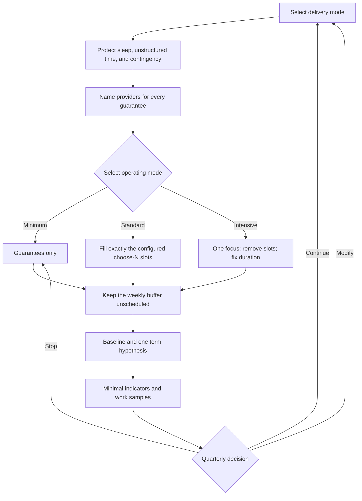
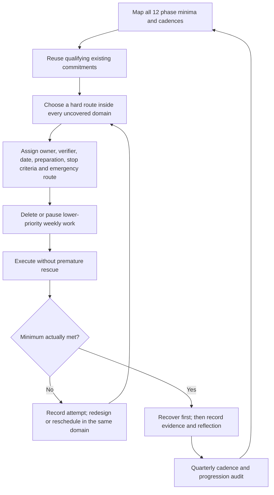

# Capacity-Governed Execution Layer

This layer converts the framework from a catalogue of desirable activities into an executable weekly portfolio. Its controlling rule is simple:

> Protect constraints, supply guarantees, choose only the permitted alternatives, and make intensives replace work rather than add work.

The machine-readable source is [`config/capacity-model.json`](../config/capacity-model.json). Run `npm run audit:capacity` after changing it or an example plan.



## 1. What the hours mean

All numbers are **child-facing directed hours per normal term week**: time in which a parent, school, tutor, coach, or programme controls the agenda. They exclude sleep, meals, hygiene, commuting, ordinary family life, and genuinely unstructured time.

- In **school-overlay mode**, the hours are incremental to school and schoolwork.
- In **hybrid mode**, the hours include all learning governed by the framework across home, micro-school, tutors, and projects; partner-school hours remain external.
- In **full-school mode**, the hours include the complete instructional programme.
- Care, conversation, reading, and outdoor life at 0-3 yr old are primarily embedded in ordinary life. Their small hour caps apply only to separately scheduled adult-led agendas.

These are planning ceilings, not developmental findings or legal minimums. Applicable schooling law, credential rules, disability provision, and provider contracts override them.

## 2. Weekly capacity by phase

Each cell is `minimum / standard / intensive / hard cap` in directed hours. Minimum is guarantees only. Standard is the default. Intensive is temporary. The hard cap is an exceptional ceiling, never a target.

| Phase | School overlay | Hybrid | Full school |
|---|---:|---:|---:|
| 0-1 yr old | 0.5 / 1.5 / 2.5 / 3 | 0.5 / 1.5 / 2.5 / 3 | 0.5 / 1.5 / 2.5 / 3 |
| 1-3 yr old | 1 / 3 / 5 / 6 | 1 / 3 / 5 / 6 | 1 / 3 / 5 / 6 |
| 4-7 yr old | 4 / 8 / 11 / 12 | 14 / 20 / 24 / 26 | 20 / 26 / 30 / 32 |
| 8-10 yr old | 5 / 9 / 13 / 14 | 16 / 23 / 27 / 29 | 22 / 29 / 33 / 35 |
| 11-13 yr old | 5 / 9 / 13 / 14 | 18 / 25 / 29 / 31 | 24 / 31 / 35 / 37 |
| 14-16 yr old | 5 / 8 / 12 / 14 | 20 / 27 / 31 / 31 | 25 / 32 / 36 / 38 |
| 17-18 yr old | 5 / 8 / 12 / 12 | 19 / 26 / 30 / 30 | 25 / 32 / 36 / 38 |

The older overlay phases are deliberately far below the former 20-24 hour aspiration. A 14-18 yr old already carrying school, homework, commute, sleep, relationships, meals, and 30% unstructured non-school waking time has approximately 8 directed framework hours in a normal week and 12 only during a temporary intensive. Every hard cap preserves at least 2 hours of additional weekly contingency; where the intensive already reaches that safe maximum, the intensive and hard cap are identical.

## 3. Staged viability runway

“The entire framework” means that all guarantees and capability categories are supplied longitudinally across development. It does **not** mean that every activity, resource, content universe, or optional track runs concurrently. A viable implementation protects the guarantees continuously, makes the relevant alternative pools available across rotations, and deliberately leaves most options inactive in any one week.

Build in this order:

| Stage | Scope being proved | Gate before advancing |
|---|---|---|
| **School-overlay pilot** | The framework integrates around an existing school's academic entitlement, peer cohort, records, and credential route without overload or duplication | One real plan passes the capacity audit and weekly actual-load review; guarantees have named providers; the external credential route is documented; one stable collective exists; safeguarding and support escalation work; selected providers produce useful feedback; the quarterly evidence loop supports continue or a bounded modification |
| **Hybrid cohort** | The framework owns named parts of the entitlement across several learners and providers while a partner institution owns the remaining named parts and credential access | Overlay gates continue to hold across the cohort; ownership boundaries and records are explicit; no subject or learner falls between providers; the peer collective remains stable; provider absence or failure has a replacement path; quarterly evidence shows the model works without chronic overload or entitlement gaps |
| **Full school** | The framework institution owns the complete academic entitlement, timetable, cohort, records, safeguarding, additional-support coordination, and credential route | Hybrid gates hold at institutional scope; lawful operation and credential recognition are confirmed; the full curriculum and progression map are staffed by demonstrably adequate providers; safeguarding, accommodations, referral, continuity, and record transfer are operational; repeated quarterly reviews justify expansion |

The gates are cumulative, not ceremonial. Do not advance because the next stage is more ambitious. A failed capacity, entitlement, credential, collective, safeguarding, provider-quality, or quarterly-evidence gate means modify, repeat, or remain at the current stage. Full-school operation is an earned delivery state, not the default starting point.

## 4. The portfolio grammar

### Guarantees: required every week

The delivery vehicle may change; the capability may not disappear.

1. Responsive relationship and emotional safety.
2. Language and communication.
3. Complete core academic entitlement. In overlay mode the external school supplies it; the learning architect verifies that supply and closes documented gaps.
4. Physical system: sleep, movement, nutrition, and recovery.
5. Collective capability: recurring work where another person is functionally necessary, not merely present.
6. Feedback and planning that changes the next week.
7. Protected autonomy: 30% of non-school waking time remains genuinely unstructured.
8. Safety and special-support escalation with a named owner.

`guaranteeHours` in the model represents directed work needed to operate these guarantees. It does not count sleep or unstructured time as instructional hours.

### Alternatives: choose N, do not accumulate

Standard mode exposes a fixed number of simultaneous slots. A slot holds one coherent track from one pool:

- deep practice;
- music or movement beyond the physical guarantee;
- making and projects;
- culture and inquiry;
- service and leadership;
- language immersion;
- route and launch work.

One activity may supply several outcomes, but it occupies one slot. One outcome spread across several duplicative activities still occupies several slots. Count commitments, transitions, and provider coordination—not just nominal instructional minutes.

Typical rotations are:

| Phase | Rotation | Maximum temporary intensive |
|---|---:|---:|
| 0-1 yr old | 2-4 weeks | 1 week; caregiver focus, not academic camp |
| 1-3 yr old | 3-6 weeks | 1 week |
| 4-7 yr old | 6-8 weeks | 2 weeks |
| 8-10 yr old | 8-12 weeks | 3 weeks |
| 11-13 yr old | 10-14 weeks | 4 weeks |
| 14-18 yr old | 12-18 weeks | 6 weeks |

An anchor may persist across rotations. All other alternatives must leave a slot before a replacement enters.

### Temporary intensives: concentrate, displace, exit

An intensive has one focus, a fixed duration, an owner, and an exit criterion. The configured intensive mode always has fewer alternative slots than standard mode.

During an intensive:

1. Guarantees remain.
2. Exactly one focus receives the configured focus hours.
3. Standard alternatives are paused until the configured lower slot count is met.
4. The weekly buffer remains unused.
5. The intensive ends at its phase limit or earlier if sleep, health, relationships, school performance, or voluntary engagement deteriorate.
6. The next week returns to standard or minimum mode; it does not retain the intensive hours.

During a school holiday, use the phase's `holidayIntensiveHardCapHours`, not the overlay term cap. The same sleep, unstructured-time, single-focus, and finite-duration rules remain.

## 5. Substitution and deletion rules

Apply these in order:

1. **Protect:** sleep, health, relationship, unstructured time, core entitlement, safeguarding, and credential obligations.
2. **Delete duplication:** if school, tutor, and home all teach the same adequate material, remove the weakest duplicate.
3. **Substitute vehicles:** replace an activity while preserving its required capability—for example, ensemble theatre can replace team sport for collective practice.
4. **Rotate:** move non-urgent alternatives to the next block instead of running them concurrently.
5. **Concentrate:** use one intensive only when a finite opportunity or plateau justifies it.
6. **Delete downward:** vanity distribution and résumé padding → recommended resources → duplicative alternatives → lowest-value active choice slot.
7. **Never borrow:** do not fund an activity with sleep, unstructured time, the weekly buffer, or another provider's uncounted workload.

Automatic reset: if the child exceeds the scheduled cap, loses protected sleep, or shows sustained fatigue for two consecutive weeks, revert to minimum mode for at least one week. Diagnose before rebuilding.

## 6. Longitudinal hardship calendar

Hardship is governed by [`config/hardship-model.json`](../config/hardship-model.json), not by the weekly choose-N count. This distinction prevents two opposite failures: treating hardship as optional enrichment, or attempting to run twelve additional programmes every week. Every age-applicable domain remains required; its vehicle, timing, and progression are chosen inside that domain.

### Convert twelve domains into a small number of real commitments

Reuse existing work, sport, travel, service, artistic, and academic commitments only when the required stimulus is genuinely present. A single event may receive several domain credits, but each credit needs its own threshold and evidence. Naming the event does not create the stimulus.

| Annual structure | Domains it can legitimately supply | Condition for credit |
|---|---|---|
| Controlled physical capstone | Physical exhaustion only | Progressive preparation; objective endpoint; technical and danger stop rules; readily available extraction; planned recovery. Do not co-credit weather, austerity, or isolation during a formal exhaustion event. |
| Expedition or field route | Strength/load, adverse weather, austere living, separation/navigation; sometimes digital abstinence or material constraint | Each condition actually occurs at the configured duration or cadence and is separately recorded. Ordinary walking, a hotel, constant messaging, or an unconstrained budget do not count. |
| External work or service placement | Real responsibility, low-status entry, service/reality; sometimes public failure/rejection | Another party depends on useful work; prior status confers no privilege; the organisation supplies external judgment. Contact with hardship without useful contribution does not count as service. |
| Device-and-budget interval | Digital abstinence and material constraint | Personal recreational access is actually removed for the configured interval; an emergency route remains; a real fixed limit forces a foregone preference without discretionary bailout. |
| Authentic judgment cycle inside existing work | Public failure/rejection | An external audience can reject or defeat the attempt; the learner receives the decision, revises materially, and re-enters. |
| Naturally occurring integrity case | Moral courage/integrity | A real choice carries a real cost. Record it after it arises; never manufacture wrongdoing, betrayal, a victim, or a false dilemma to satisfy the ledger. |

The table is a compression pattern, not a mandate to bundle. Formal physical exhaustion remains isolated by the one-stressor rule. Other combinations receive compound credit only when every component remains genuine rather than diluted.

### Schedule the full cycle



Preparation, transport, the event, and recovery all consume capacity. Put them into the actual-load ledger. In an event week, pause alternatives until the plan fits the appropriate weekly or holiday cap; never hide those hours because the event occurs outside school. A minimum-mode week may postpone an episode for illness, overload, examinations, or recovery. It does not erase the domain, weaken its minimum, or create retrospective credit.

Distribute events across the phase. The annual plan should expose missing domains early enough to train and reschedule. A dramatic final-year cluster is operational failure: it confounds learning with accumulated fatigue and creates pressure to ignore contraindications or accept theatrical substitutes.

### Machine-readable hardship plan and evidence ledger

One phase plan contains exactly one entry for each of the twelve domains. Every entry names the configured cadence, chosen route, irreducible minimum, owner, evidence plan, and the commitments it will displace. Substantial episodes additionally name preparation, objective completion and stop criteria, the danger boundary, an emergency or extraction route, recovery, and an external verifier where judgment or responsibility must be external.

Hardship model v2 does not ask the auditor to infer numeric obligations from prose-like cadence labels. `requirementsByDomain` expresses recurrence, duration, deadline, setting, communication boundary, and annual evidence count as typed values. Each plan mirrors those obligations in `requirementCommitments`; a completed ledger supplies `requirementResults`. The validator therefore rejects both a weakened plan and a completion claim whose observed count or duration misses the configured minimum.

| Structured gate | Machine-enforced interpretation |
|---|---|
| 8–10 yr old digital abstinence | At least twelve 24-hour periods per plan year, plus one 48-hour period. |
| 11–18 yr old moral courage/integrity | At least one verified naturally occurring case per plan year; manufactured cases remain forbidden. |
| By 16 yr old separation/navigation | At least one solo wilderness night, with communication restricted to emergency use. |
| 17–18 yr old public failure/rejection | Annual, not merely once during the phase. |
| 17–18 yr old service/reality | At least six months of sustained service. |
| 17–18 yr old digital abstinence | At least two 24–48-hour periods per plan year—the explicit minimum used for “recurring”—plus one seven-day period. |

Completion is not self-certified by a story. Record the date and duration, what objectively occurred, who verified it, what consequence or uncertainty remained real, which stop signal appeared, recovery, repair or revision, and the next progression. For compound events, record separate evidence against each credited domain. For moral courage, protect the people involved and record only what is necessary to establish the competing incentives, action, cost, and repair.

Validate the repository examples or an individual plan with:

```sh
npm run audit:hardship
node tools/audit-hardship.mjs --plan path/to/hardship-plan.json
```

The audit can prove coverage, cadence, typed counts, durations, deadlines, communication boundaries, required planning fields, and the formal-exhaustion one-stressor contract. It cannot prove that an event was honestly reported, competently supervised, lawful, or educationally effective. Those remain human and provider responsibilities.

## 7. Ownership and staffing

One person may hold several roles, but every role must be named. “The family” or “the school” is not an owner.

| Role | Owns | Default by delivery mode |
|---|---|---|
| Learning architect / capacity owner | Weekly ledger, choose-N decisions, deletion, rotation, cross-provider conflicts | Parent in overlay; designated coordinator in hybrid/full school |
| Academic owner | Complete academic entitlement, diagnostics, progression, intervention | External school / shared academic lead / school academic lead |
| Specialist instructor | One bounded domain, practice design, concise progress evidence | Tutor, practitioner-teacher, or coach |
| Collective-capability owner | Stable group, role interdependence, conflict and collaboration evidence | School, club, ensemble, team, lab, or project facilitator |
| Credential owner | Registration, official record, transferability, deadlines | External school or named credential lead |
| Safeguarding and support owner | Vetting, reporting, accommodations, referral, health and special-support escalation | External school plus parent in overlay; named institutional lead in hybrid/full school |
| Learner | Increasingly proposes alternatives, keeps evidence, and co-audits workload | Consulted at 4-7 yr old; co-owner at 8-13 yr old; primary planner at 14-18 yr old |

Every provider receives a one-page brief: intended capability, weekly allocation, evidence expected, what the provider may stop, and who resolves conflicts. Provider prestige does not create additional capacity.

## 8. Instructional allocation, progression, and support

### Allocate the event, not the subject

No entire subject is inherently individual or collective. Mathematics, science, history, music, and writing all contain tasks that benefit from different instructional forms.

| Form | Use when | Typical examples | Capacity rule |
|---|---|---|---|
| Individually paced | Pace, prerequisite, repetition, or feedback differs materially | retrieval, calculation fluency, drafting and revision, instrumental technique, source annotation | Lives inside a guarantee or alternative slot; adaptive software does not create extra hours |
| One-to-one | A diagnostic interview, misconception, technique bottleneck, access need, or high-level coaching warrants scarce attention | worked-example correction, reading diagnosis, pronunciation, mentoring, specialist tuition | Time-box it, name the owner and exit criterion, then return to the least intensive effective form |
| Small group | Learners share a need or improve by exposing reasoning to one another | explicit instruction for a common gap, seminar, critique, laboratory, rehearsal, collaborative problem solving | Group by current task where useful; regroup at review rather than treating the group as identity |
| Stable collective | Interdependence is itself the capability | ensemble, team, production, debate, field investigation, service role | Required to supply collective capability; attendance near peers without role interdependence does not count |

A science sequence may therefore combine individual prerequisite work, a short explicit explanation, a group laboratory, and an individual analysis. A history sequence may combine individual source reading and a seminar. A tutor can improve many individual components, but cannot simulate the negotiation, coordination, audience, or conflict of a functioning collective.

### Diagnostic and mastery progression

1. Preserve a common entitlement; personalise sequence, dose, examples, output form, assistive support, and pace—not whether the learner receives the entitlement.
2. Begin a rotation with one representative task, a short diagnostic conversation, and prior work. Identify the present prerequisite or bottleneck rather than assigning a global ability label.
3. Use explicit/direct instruction when knowledge is new, fragile, safety-critical, or blocked by a known misconception. Use guided inquiry after enough prior knowledge exists to make the inquiry productive. Use independent practice after the learner can begin accurately.
4. For sequence-dependent skills, advance after accurate independent performance on at least two non-identical opportunities, including one after a delay, plus transfer when transfer matters. Do not manufacture a percentage threshold when the task has no meaningful error scale.
5. For open-ended inquiry, history, art, and extended writing, judge the quality of evidence, reasoning, craft, revision, and increasing independence. These domains have progression and standards, but not a fictitious binary mastery state.
6. If the learner does not progress after two short teaching cycles, change the explanation, example set, modality, group, provider, or support. Do not automatically add hours.

Diagnostics answer the next instructional question; they are not permanent rankings. Group membership, pace, and support are reconsidered each rotation.

### Credentials and additional needs

- The credential owner maps the official route, required subjects, assessment windows, transfer rules, and deadlines before the term. The portfolio complements official evidence; it does not silently replace a required credential.
- School and framework assessments are not duplicated unless the second instrument answers a documented question the first cannot answer.
- A disability, health, language, or access plan overrides generic delivery assumptions. Required therapy, specialist instruction, and travel count in the directed-time ledger; delete alternatives before reducing sleep, recovery, or legally required provision.
- Accommodations change access, representation, pacing, environment, or response mode while preserving the intended capability where possible. A named safeguarding/support owner coordinates specialists and escalation; the capacity auditor is not a diagnostic instrument.

## 9. Weekly operating loop

1. Record external school, study, commute, and provider load.
2. Select delivery mode and operating mode.
3. Confirm every guarantee has a provider and escalation owner.
4. Fill only the configured alternative slots.
5. Reserve the buffer; do not schedule it prospectively.
6. Compare planned and actual hours, sleep, fatigue, joy, and missed commitments.
7. Delete or rotate before adding.

The audit validates structural feasibility. It cannot determine whether a provider is effective, a credential route is valid, or a child is thriving; those require evidence and human judgment.

## 10. Educational execution and evaluation engine

This is distinct from software/content integrity testing. A green build proves that the application works; it does not prove that the education works.

Each rotation carries one deliberately falsifiable term record:

1. **Baseline:** a small number of existing work samples, current capability, actual weekly load, and the learner's stated experience. No personality inference is required.
2. **Term hypothesis:** one sentence of the form, “If we provide X under conditions Y, we expect capability Z to improve without degrading sleep, agency, relationships, or health.”
3. **Leading indicators and work samples:** at most four low-burden indicators and three recurring samples. Prefer retrieval checks, drafts and revisions, performances, solved problems with reasoning, practice logs kept by the learner, and planned-versus-actual workload.
4. **Quarterly review:** compare the new work with baseline, check transfer and retention, ask the learner, and inspect capacity costs and unintended effects.
5. **Decision:** explicitly **continue**, **modify**, or **stop**. “Continue because it sounds good” is not a valid default.

Do not continuously record location, keystrokes, browsing, conversations, biometrics, or social interaction. Do not convert ordinary childhood into a dashboard. Followers, likes, revenue, admissions visibility, and competition prestige may be route-specific external evidence; they are never general weekly learning indicators. Collect the minimum evidence needed to make the next decision, retain it only as long as useful, and give the learner increasing ownership of it.

The capacity audit requires this loop in plan files and caps the number of indicators and work samples. Human review still determines whether the evidence is meaningful.

## 11. Weekly-capacity plan file

A plan is a small JSON record:

```json
{
  "phaseId": "age-14-16",
  "deliveryMode": "overlay",
  "operatingMode": "standard",
  "rotationWeeks": 16,
  "guaranteeHours": 5,
  "protectedSleepHoursPerNight": 9,
  "protectedUnstructuredHoursPerWeek": 18.9,
  "guaranteesCovered": ["...all required guarantee ids..."],
  "alternatives": [
    { "id": "monthly-essay", "poolId": "culture-inquiry", "hours": 1, "owner": "writing-tutor" },
    { "id": "product-build", "poolId": "making-projects", "hours": 1, "owner": "product-mentor" }
  ],
  "intensive": null,
  "owners": {
    "capacity": "parent-a",
    "academic": "external-school",
    "collective": "debate-coach",
    "credential": "external-school",
    "safeguarding": "parent-a-and-school-lead"
  },
  "evaluation": {
    "baseline": "Review one prior argument and one prior project, plus the actual weekly load.",
    "termHypothesis": "Two bounded alternatives will improve revision and execution without degrading protected capacity.",
    "leadingIndicators": ["planned versus actual hours", "sleep and unstructured time", "learner challenge/joy reflection"],
    "workSamples": ["revised argument", "project changelog and demonstration"],
    "quarterlyReview": {
      "reviewCadenceWeeks": 12,
      "decisionOptions": ["continue", "modify", "stop"],
      "decisionRule": "Continue only if work quality or transfer improves without sustained capacity or wellbeing cost."
    }
  }
}
```

Audit one file with:

```sh
node tools/audit-capacity.mjs --plan path/to/plan.json
```

The package audit also validates the three reference plans in `docs/examples/`.
