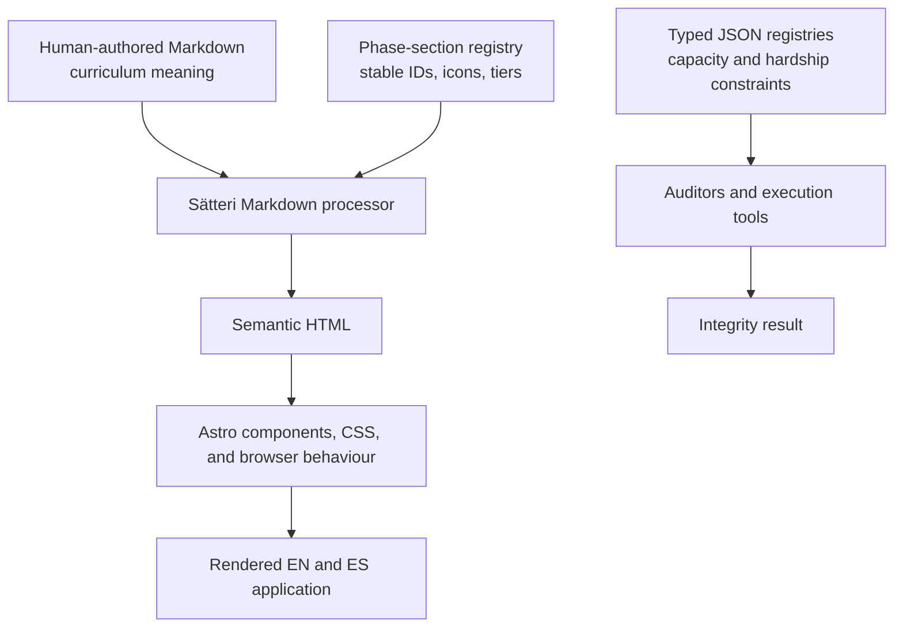

# Markdown Authoring Contract

The content layer is human-readable Markdown. It does not contain presentation HTML, CSS classes, or machine-only requirement attributes.



## Ownership boundaries

| Layer | Owns | Must not own |
|---|---|---|
| `src/content/**/*.md` | Curriculum wording, headings, lists, tables, links, quotations and visible evidence | Raw HTML, CSS classes, opaque `data-*` contracts or duplicated machine constraints |
| `config/*.json` | Exact capacity and hardship requirements, counts, durations, milestones and validation semantics | Explanatory curriculum prose |
| `src/markdown/*.mjs` | Stable section IDs, icons, tiers and presentation hooks derived from visible structure | Curriculum wording or hidden educational requirements |
| `src/scripts/` and `src/styles/` | Interaction and presentation | Source-of-truth curriculum values |
| `tools/audit-*.mjs` | Structural and semantic integrity checks | Repairing invalid content at runtime |

## Phase Markdown conventions

Each phase document requires YAML frontmatter, exactly one level-one heading, and registered level-two section headings.

### Target maps

Write the target map as an ordered list under its registered heading. Each of the eleven items begins with the bold target name and continues with a separate description paragraph.

```md
## Activity Map

1. **Resilient Self-Efficacy.**

   Visible description.
```

The presentation layer derives the card grid and target numbers. Do not add HTML wrappers.

### Profile adjustments and callouts

Use blockquotes with visible labels:

```md
> **Profile — Introvert.**
>
> Adjustment text.

> **Note.**
>
> Explanatory text.

> **Warning.**
>
> Warning text.

> **Evidence.**
>
> Evidence text.
```

Spanish documents use `Perfil`, `Nota`, `Advertencia` and `Evidencia`. Profile labels must match a registered label in `src/markdown/phasePresentation.mjs`; the build derives the corresponding presentation class.

### Mental-model trackers

Use one bold layer label followed by a bullet list. Each item uses this exact visible grammar:

```md
**Layer 2: Name**

- **5 · new · Maps≠** — Maps ≠ Territory — Is this the thing, or a representation?
```

Allowed status words are `new`, `active` and `future`, or their registered Spanish equivalents. Browser code progressively enhances this list into the compact tracker; the unenhanced Markdown remains complete and readable.

### Resource tiers

Resource tables use ordinary GitHub-Flavoured Markdown. A tier separator is a row whose first cell begins with a recognized tier label and whose remaining cells are empty.

```md
| Resource | Type | Description |
|---|---|---|
| FOUNDATIONAL — Integral to program |  |  |
| Example | Book | Description and target name |
```

Recognized English tiers are `FOUNDATIONAL`, `CORE` and `RECOMMENDED`; the Spanish parser also recognizes `FUNDACIONAL` or `FUNDAMENTAL`, `CENTRAL`, and `RECOMENDADO`.

### Internal universe links

Use ordinary Markdown anchors such as `[Dune](#universe-dune)`. The application routes these links to the corresponding universe view. Do not add `data-universe-nav` manually.

## Stable section identity

The exact heading-to-ID, icon and tier mapping lives in `src/markdown/phaseSections.mjs`. When adding or renaming a registered level-two heading:

1. Update both English and Spanish registry entries.
2. Preserve the stable ID unless the change intentionally includes a migration.
3. Update the semantic presentation fixtures.
4. Run the complete test suite.

## Commands

```sh
npm run audit:markdown
npm run test:markdown-presentation
npm test
npm run build
```

`npm run audit:markdown` parses every content document and rejects raw HTML. `npm run migrate:phase-markdown` is the idempotent legacy migration command: already-semantic files are left unchanged.
